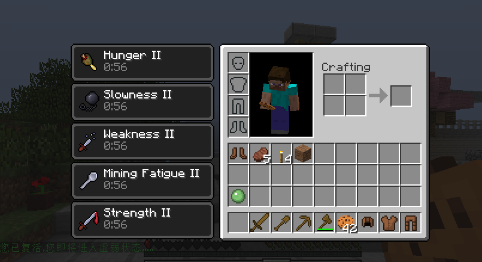
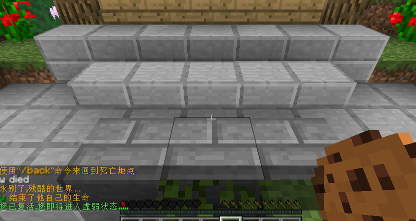

### Mincraft Bukkit RespawnFeeble 插件



## 这个玩意有什么用？QVQ
> 当玩家死亡重生之时，将会进入你所设置的“虚弱状态”，可以有效的压迫玩家“珍惜生命”。
> 当玩家血量值少于指定时，将爆发自己的潜能。

## 类型？
> |Cauldron插件| |CraftBukkit插件| |Spigot插件| |Sponge插件| （理论上全部支持）。

## 如何配置？ 
> config.yml文件配置

```yml
#版本号配置，切勿修改
version: 1.1

RespawnWeakness:
    Enable: true #是否开启重生就会进入虚弱状态
    RespawnHealth: 1 #玩家复活时虚弱状态的血量
    Time: 60 #虚弱状态持续时间
    EffectList: #虚弱状态的药水效果作用列表：
            - '1'
            - '8'
            - '2'
            - '6'
            - '9'
#是否开启 生命垂危时进入 特定状态
HealthWeakness:
    Enable: true        #是否开启 生命垂危时进入 特定状态
    MinHealth: 4 #进入特定状态的最低血量，半颗心就是1！4就是两颗心的意思、
    Time: 15 #进入特定状态后 药水效果持续时间
    EffectList: #进入特定状态后 药水效果列表
            - '10'

#药水效果代表代码：
#玩家复活重生之后的药水效果列表
#1:缓慢移动
#2:挖掘缓慢
#3:失明
#4:防火
#5:枯萎
#6:虚弱
#7:混乱
#8:饥饿
#9:增加伤害
#10：速度
#11：快速挖掘
#12：伤害加倍，不建议用在 特定状态下。
#13：治愈
#14：跳跃力
#15：饱和
```
### 编码一致。
- 请注意配置文件是否正确，在启动服务器的时候插件是否输出了异常，因为有些人说药水没效果有可能是因为配置加载失败导致药水为空。
- 如果依然出现药水无作用，可尝试删除配置文件里面的中文或转换编码。

### 感谢查看
如果你愿意给予我支持，感谢你的支持。你有任何问题可以向我发送邮件。
